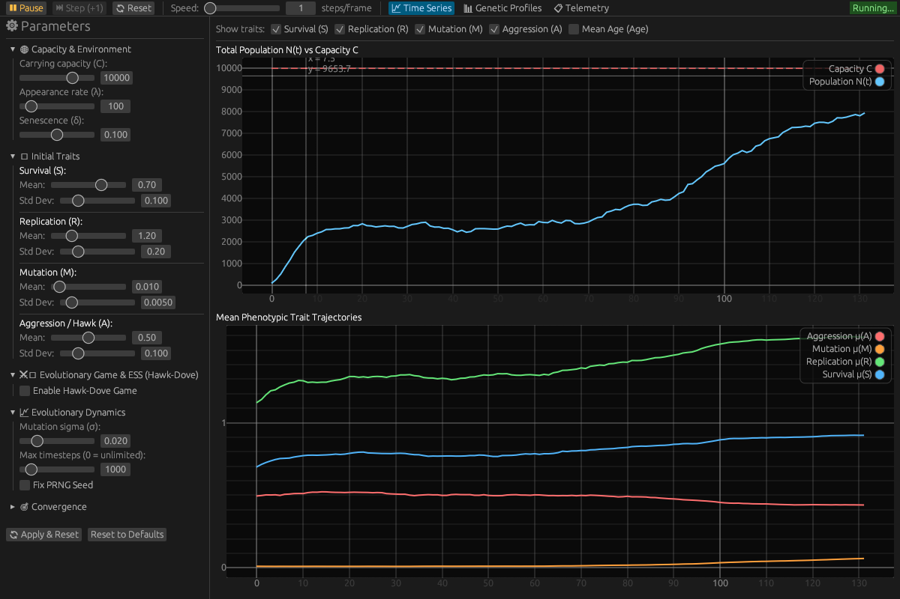

# Selfish Gene Simulator 🧬


A high-performance evolution simulator based on Richard Dawkins' **Selfish Gene** theory, implemented in Rust with both a terminal CLI and a native cross-platform Graphical User Interface (GUI).



## Features

- **Evolutionary simulation engine**: Core biological models (survival, replication, mutation, age senescence, and game theory interactions).
- **Evolutionary Game Theory & ESS (Hawk-Dove Model)**: Pairwise competitive encounters for contested resources ($V$) with combat injury mortality risks ($C$), demonstrating dynamic convergence to Maynard Smith's Evolutionarily Stable Strategy ($p^* = V/C$).
- **Interactive GUI Application (`selfish-gene-gui`)**:
  - Real-time time series plots (`egui_plot`) for population $N(t)$ vs $C$, trait means $(\bar{S}, \bar{R}, \bar{M}, \bar{A})$, and age.
  - Interactive parameter controls: sliders for capacity, appearance rate, initial trait distributions, Hawk-Dove game parameters, mutation noise, and convergence.
  - Genotype / phenotype distribution histogram with abundance percentages across 4D trait space.
  - Playback controls: Play, Pause, Step (+1 generation), Reset, and simulation speed throttle (steps per frame).
  - Ecosystem telemetry dashboard and one-click JSON export.
- **Terminal CLI Application (`selfish-gene`)**:
  - Real-time ASCII bar chart TUI or clean text log mode.
  - Signal handling: graceful termination with Ctrl+C, SIGINT, and SIGTERM.
- **Strict Reproducibility**: Exact determinism via PRNG `--seed`.
- **Convergence Detection**: Automatic equilibrium / ESS detection via sliding variance windows.

## Installation & Running

### Requirements

- Rust 1.75+ (with Cargo)

### Running the Graphical User Interface (GUI)

```bash
# Launch interactive GUI
cargo run --bin selfish-gene-gui --release
```

### Running the Command Line Interface (CLI)

```bash
# Run with default parameters and live terminal TUI
cargo run --bin selfish-gene --release

# Run Hawk-Dove ESS experiment (V=2.0, C=10.0 => p* = 0.20)
cargo run --bin selfish-gene -- --enable-game-theory --game-resource-value 2.0 --game-injury-cost 10.0

# Run for 500 timesteps in text log mode
cargo run --bin selfish-gene -- --max-timesteps 500 --no-live-display

# Export results to JSON
cargo run --bin selfish-gene -- -o results.json
```

### Configuration options

```bash
# Simulation parameters
-C, --capacity <N>                    Maximum population capacity [default: 10000]
-a, --appearance-rate <RATE>          New replicators per timestep (Poisson λ) [default: 100]
-t, --max-timesteps <N>               Maximum timesteps (0 = unlimited) [default: 1000]
--senescence-rate <RATE>              Senescence rate (age-dependent mortality factor, default 0 = disabled)

# Evolutionary Game Theory (Hawk-Dove)
--enable-game-theory                  Enable pairwise game encounters
--game-resource-value <V>             Contested resource payoff value [default: 2.0]
--game-injury-cost <C>                Combat injury penalty in Hawk-Hawk fights [default: 10.0]
--game-interaction-rate <RATE>        Mean encounters per individual per step [default: 1.0]

# Initial trait distributions (mean and std dev)
--init-survival-mean <MEAN>           [default: 0.7]
--init-survival-std <STD>             [default: 0.1]
--init-replication-mean <MEAN>        [default: 1.2]
--init-replication-std <STD>          [default: 0.2]
--init-mutation-mean <MEAN>           [default: 0.01]
--init-mutation-std <STD>             [default: 0.005]
--init-aggression-mean <MEAN>         [default: 0.5]
--init-aggression-std <STD>           [default: 0.1]

# Evolution parameters
--mutation-sigma <SIGMA>              Gaussian noise for mutations [default: 0.02]

# Convergence settings
--convergence-threshold <THRESHOLD>   Trait variance threshold [default: 0.001]
--convergence-window <WINDOW>         Timesteps to check for stability [default: 50]

# Display options
--display-interval <N>                Show stats every N timesteps [default: 10]
--no-live-display                     Use text log instead of live visualization
--top-profiles <N>                    Number of profiles in bar chart [default: 15]

# Output
-o, --output-file <FILE>              Export results to JSON

# Reproducibility
--seed <SEED>                         PRNG seed for deterministic runs
```

## Documentation

Comprehensive project documentation is available in the [`docs/`](docs/) directory:

- 📖 **[Theoretical Foundations (`docs/theory.md`)](docs/theory.md)**: Richard Dawkins' selfish gene principles, population genetics, and mathematical formulations.
- ⚙️ **[Parameter Reference (`docs/parameters.md`)](docs/parameters.md)**: Full CLI reference, mathematical formulas, parameter domains, and scenario presets.
- 🏗️ **[System Architecture (`docs/architecture.md`)](docs/architecture.md)**: Codebase modules, execution lifecycle flow, and data pipelines.
- 🚀 **[Extension Guide (`docs/extending.md`)](docs/extending.md)**: Protocols for adding new traits, environmental dynamics, and game theory interactions.
- 🤖 **[AI Guidelines (`AGENTS.md`)](AGENTS.md)**: Project compass and consistency rules for AI programming assistants.

## How it works

### The Model

Each **replicator** has four heritable continuous traits:

1. **Survival rate** ($S \in [0, 1]$): Base probability of surviving each timestep.
2. **Replication rate** ($R \ge 0$): Baseline expected offspring produced per timestep.
3. **Mutation rate** ($M \in [0, 1]$): Probability of trait mutation during replication.
4. **Aggression propensity** ($A \in [0, 1]$): Probability of choosing the aggressive **Hawk** strategy in pairwise resource contests.

### Simulation cycle

Each timestep:

1. **Appearance**: New primordial replicators appear (Poisson distribution).
2. **Game Interactions (Hawk-Dove)**: When enabled, individuals engage in pairwise contests for resources ($V$) risking injury ($C$).
3. **Survival & Combat Injuries**: Each replicator survives based on its baseline survival, age senescence decay, and combat injury penalties.
4. **Replication**: Survivors produce offspring scaled by resource availability ($\Phi(N) = 1 - N/C$) and resource payoffs.
5. **Mutation**: Offspring traits undergo Gaussian perturbation $\mathcal{N}(0, \sigma_m)$ if a mutation roll passes.
6. **Aging**: Chronological age increases by 1 for all surviving individuals.

### Evolutionary pressure

- **Density pressure**: When population is low ($N \ll C$), replication is near maximum; near capacity ($N \to C$), reproduction halts.
- **Senescence pressure**: Age mortality accelerates with time ($e^{-\gamma \cdot \text{age}}$), favoring early reproductive investment.
- **Game-theoretic pressure (ESS)**: In aggressive populations ($A > V/C$), high injury costs penalize Hawks, selecting for peaceful Doves; in peaceful populations ($A < V/C$), Hawks exploit Doves, driving aggression toward the equilibrium $p^* = V/C$.

## Visualizations & Example Output

### 1. Interactive Graphical User Interface (`selfish-gene-gui`)

The native desktop application (shown in the [preview above](#selfish-gene-simulator-)) provides real-time time-series plots (`egui_plot`), genetic phenotype distribution bars, interactive parameter sliders, and telemetry diagnostics.

### 2. Live Terminal TUI Mode (`selfish-gene`)

```
╔════════════════════════════════════════════════════════════════════════════╗
║ Timestep:    100  |  Population: 10000 / 10000                             ║
╠════════════════════════════════════════════════════════════════════════════╣
║ Profile Distribution (Top 15 profiles)                                     ║
╠════════════════════════════════════════════════════════════════════════════╣
║ S:1.0 R:1.1 M:0.01 A:0.2 │ █████████████████████████████████████████  9840 ║
║ S:1.0 R:1.3 M:0.01 A:0.2 │ ██                                           95 ║
║ S:0.9 R:1.2 M:0.01 A:0.3 │                                              42 ║
║ S:1.0 R:1.0 M:0.01 A:0.2 │                                              15 ║
╚════════════════════════════════════════════════════════════════════════════╝

Legend: S=Survival, R=Replication, M=Mutation, A=Aggression (Hawk)
```

### Final statistics

```
════════════════════════════════════════════════════════════════
                    FINAL POPULATION
════════════════════════════════════════════════════════════════
Final population size:    10000
Average survival rate:    0.994210
Average replication rate: 1.121540
Average mutation rate:    0.007812
Average aggression:       0.201450
Average age:              14.2315
════════════════════════════════════════════════════════════════
```

## Observations

Typical evolutionary patterns observed:

- **Survival rate → 1.0**: Strong selection for maximum survival
- **Replication rate → 1.1-1.4**: Optimal balance with resource constraints
- **Mutation rate → ~0.01**: Maintains variability without destabilizing
- Initial diversity converges to 1-3 dominant profiles

## Testing

Run unit tests:

```bash
cargo test
```

## Performance

Built with Rust for maximum performance:
- Handles 10,000+ replicators efficiently
- Real-time visualization updates
- Minimal memory footprint

## License

MIT License - see [LICENSE](LICENSE) file for details.

## Contributing

Contributions are welcome! Please feel free to submit a Pull Request.

## References

- Dawkins, R. (1976). *The Selfish Gene*. Oxford University Press.

## Author

Vikman Fernandez-Castro
