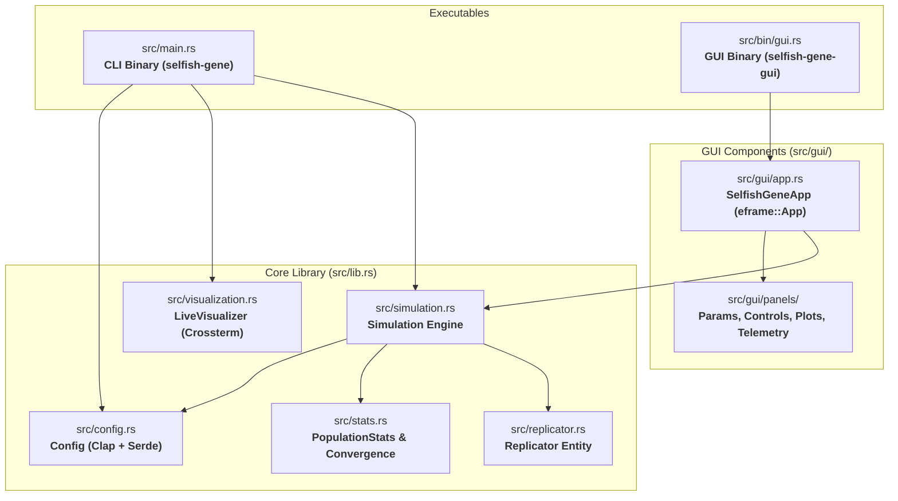
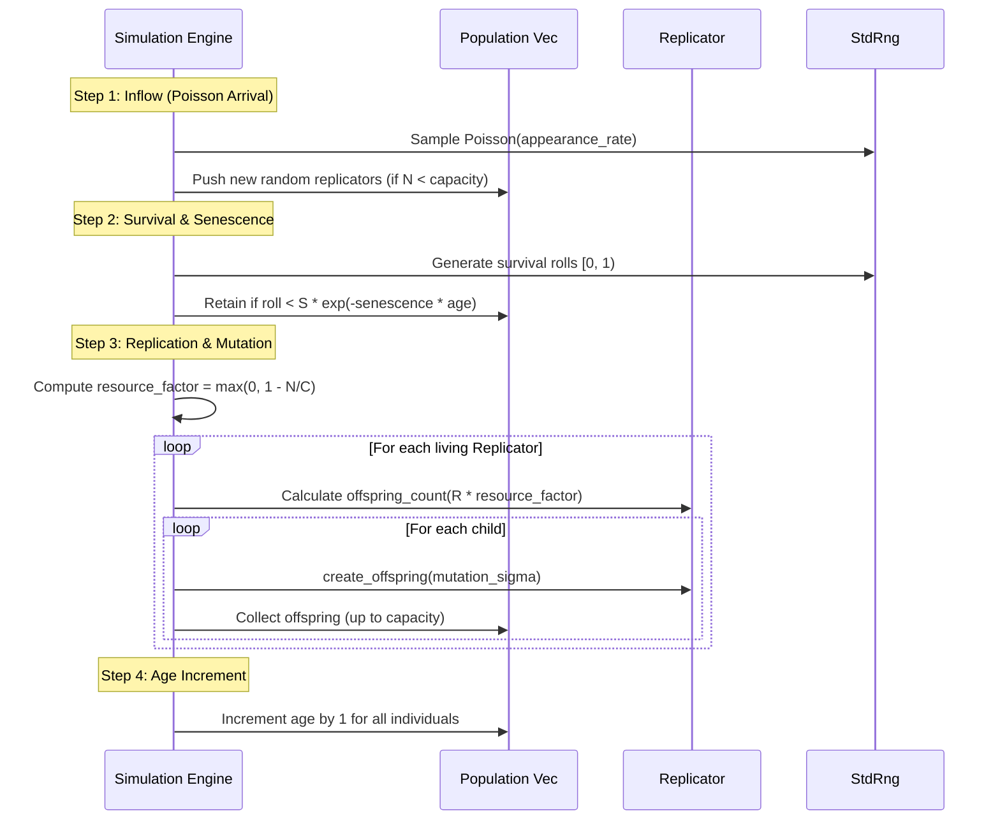

# System Architecture & Code Map (`architecture.md`)

This document details the software architecture, module responsibilities, execution lifecycle, and data flow of the **Selfish Gene Simulator**.

---

## 1. High-Level Architecture Diagram

---

## 2. Module Responsibilities

### 2.1 `src/lib.rs` — Core Library Re-exports
- Re-exports domain types (`Replicator`, `Simulation`, `Config`, `PopulationStats`, `ConvergenceDetector`, `SimulationHistory`, `LiveVisualizer`).
- Provides public API for headless simulations, tests, CLI, and GUI consumers.

### 2.2 `src/main.rs` — CLI Entrypoint (`selfish-gene`)
- **Signal Handling:** Uses `signal_hook` to catch `SIGINT` (Ctrl+C) and `SIGTERM`, setting an `Arc<AtomicBool>` flag.
- **Initialization:** Parses CLI arguments into `Config` and instantiates the `Simulation` runner with terminal visualization.

### 2.3 `src/bin/gui.rs` & `src/gui/` — GUI Application (`selfish-gene-gui`)
- **`src/bin/gui.rs`:** Sets window dimensions, icons, and launches `eframe::run_native`.
- **`src/gui/app.rs` (`SelfishGeneApp`):** Implements `eframe::App`, orchestrating frame updates, continuous simulation ticks, and panel rendering.
- **`src/gui/panels/params.rs`:** Categorized parameter sliders and drag values with live validation and tooltips.
- **`src/gui/panels/controls.rs`:** Play/Pause/Step/Reset toolbar, simulation speed slider, and status badges.
- **`src/gui/panels/time_series.rs`:** Multi-line real-time plotting with `egui_plot` for $N(t)$ vs $C$, trait means $(\bar{S}, \bar{R}, \bar{M})$, and variances.
- **`src/gui/panels/profiles.rs`:** Ranked phenotype distribution bar chart matching Dawkinsian trait bins.
- **`src/gui/panels/telemetry.rs`:** Ecosystem metrics grid, ESS winner profile card, and JSON export button.

### 2.4 `src/config.rs` — Configuration & CLI Schema
- **`Config` Struct:** Derives `clap::Parser`, `serde::Serialize`, and `serde::Deserialize`.
- Acts as the single source of truth for all simulation settings and defaults.

### 2.5 `src/replicator.rs` — Biological Entity Model
- **`Replicator`:** Represents an individual with traits $(S, R, M)$ and state $a$ (`age`).
- **`from_distributions()`:** Samples initial traits from Gaussian distributions.
- **`create_offspring()`:** Clones traits and applies Gaussian mutation noise $\mathcal{N}(0, \sigma_m)$ if a mutation roll passes.

### 2.6 `src/simulation.rs` — Simulation Engine & Lifecycle
- Maintains the active population `Vec<Replicator>`, the pseudo-random generator `StdRng`, and the timeline counter `timestep`.
- Exposes fine-grained methods (`step()`, `reset()`, `initialize_population()`, `winner_profile()`, `history()`) supporting both batch CLI runs and frame-by-frame GUI stepping.

### 2.7 `src/stats.rs` — Statistical Engine & Convergence Detection
- **`PopulationStats`:** Computes population size, means ($\mu$), standard deviations ($\sigma$), and age metrics for each timestep.
- **`ConvergenceDetector`:** Maintains a sliding window (`VecDeque<PopulationStats>`) of size $W$. Detects convergence when $\max(\sigma_S, \sigma_R, \sigma_M) < \epsilon$ for all entries in the window.
- **`SimulationHistory`:** Serializes the complete timeline to formatted JSON for offline scientific analysis.

### 2.8 `src/visualization.rs` — Real-Time Terminal User Interface
- **`ProfileBin`:** Discretizes the continuous 3D trait space into discrete histogram bins:
  - Survival: 10 bins ($0.0 - 1.0$)
  - Replication: 20 bins ($0.0 - 2.0$)
  - Mutation: 5 bins ($0.00 - 0.05$)
- **`LiveVisualizer`:** Utilizes `crossterm` in raw mode with ANSI escape sequences to render non-flickering ASCII bar charts.

---

## 3. Generational Step Lifecycle

The `Simulation::step()` method executes four deterministic phases sequentially:

---

## 4. Performance & Memory Design

- **Contiguous Allocation:** The population is stored in a flat `Vec<Replicator>`.
- **RNG Determinism:** When `--seed` is provided, `StdRng::seed_from_u64` ensures reproducible experiments across platforms.
- **Zero-Allocation Stats:** Trait means and standard deviations are computed in single-pass iterators without intermediate allocations.
- **Safe Signal Trapping:** Terminal raw mode is cleanly restored via the `Drop` implementation on `LiveVisualizer`, even upon interruption.
